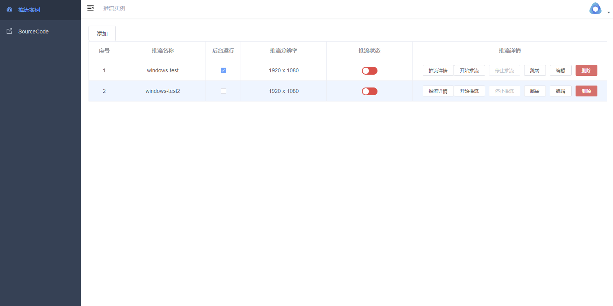
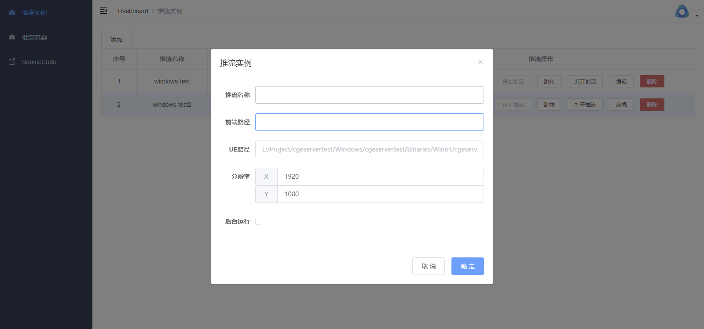

<br />
<div align="center">
  <a href="https://github.com/scially/cgeserver">
    
  </a>

  <h3 align="center">CGEServer</h3>

  <p align="center">
    一款好用的UE推流部署、发布软件
    <br />
    <a href="https://github.com/scially/cgeserver"><strong>Explore the docs »</strong></a>
    <br />
    <br />
  </p>
</div>


<!-- ABOUT THE PROJECT -->
## About The Project




一键式UE像素流部署、发布软件，基于FastApi、Vue开发，前后端分离，提供Windows下exe安装包，无需安装配置环境。提供简单易用的界面，帮助你轻松实现UE项目的推流、发布。

<!-- GETTING STARTED -->
## Getting Started

### Prerequisites

1. 后端采用poerty管理python工程，请确保安装了poetry。
2. 前端使用vue开发，请确保安装了node.js、npm。
3. 打包采用PyInstaller，请确保安装了PyInstaller(可选)

### Installation

1. Clone the repo
   ```sh
   git clone https://github.com/scially/cgeserver
   ```
2. Install Python packages
   ```sh
   poetry install
   ```
3. Install NPM packages
   ```sh
   cd front
   npm install
   ```
4. Build Application(for Windows)
   ```sh
   cd front
   npm run build
   cd ..
   pyinstaller ./cgeserver.spec
   ```
<!-- USAGE EXAMPLES -->
## Usage

系统地址为http://ip:port/app/index.html, 默认端口为9000，可通过配置文件(settings.env)修改。


### 配置UE推流实例
1. 点击添加按钮，输入推流名称、UE打包路径（必须是PackageDir\ProjectName\Binaries\Win64目录下的exe文件）、前端路径（可选，需要信令服务器支持）等信息

2. 依次点击开始推流、打开推流，就可以看到UE推流画面了，该地址也可以直接通过iframe嵌入到前端页面中。


<!-- ROADMAP -->
## Roadmap

- [ ] 补充信令服务器使用说明
- [ ] 增加多实例支持

<!-- LICENSE -->
## License

Distributed under the MIT License. See `LICENSE.txt` for more information.
